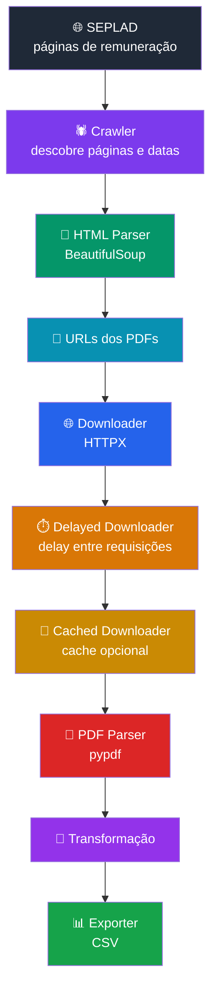

<div align="center">

# 🧾 barbalho-etl

<p>
  Um ETL para extração, transformação e consolidação
  de dados remuneratórios dos servidores públicos do Estado do Pará.
</p>


<br>

<sub>
  Feito com Python, asyncio e uma quantidade emocionalmente questionável de PDFs.
</sub>

</div>

---

## 🧐 O que é?

O **barbalho-etl** é um pipeline ETL escrito em Python para extrair, transformar e consolidar quanto cada servidor público do Estado do Pará ganha,
sem exceções, sem misticismo e sem precisar descobrir qual dos 47 PDFs chamados `remuneracao_final_novo.pdf` é o certo.

Ele entra nas páginas da [SEPLAD](https://www.seplad.pa.gov.br/), encontra os períodos disponíveis, caça os links, baixa os documentos, abre os PDFs
e tira de dentro deles as informações que deveriam ter vindo em uma tabela desde o começo.

Não vieram. Vieram em PDF. **PDF.** 

A invenção que pegou uma informação que naturalmente seria uma tabela e falou "e se a gente transformasse isso numa folha virtual
que preserva exatamente o formato visual e torna a vida de quem precisa extrair os dados consideravelmente mais interessante?"

E alguém aprovou.

### 💥 O problema

A fonte de dados não entrega uma tabelinha bonitinha dizendo:

```text
NOME | ÓRGÃO | CARGO | REMUNERAÇÃO
```

Seria civilizado.

Seria previsível.

Seria praticamente indecente de tão fácil.

Em vez disso, existem páginas, períodos, links e uma coleção de documentos PDF esperando para serem localizados, baixados e interpretados,
cada um com sua pequena contribuição para a deterioração da relação entre o ser humano e o formato de arquivo.

Então o **barbalho-etl** entra para fazer o trabalho que ninguém queria fazer manualmente: descobrir os documentos, baixar os arquivos,
processar o conteúdo e transformar aquela massa documental em dados estruturados.

É o momento em que o software olha para um PDF e pergunta "beleza, mas cadê o nome, o órgão e a remuneração nessa porra?".

<div align="center">

<sub><b>barbalho-etl</b> não é uma AGI.</sub><br>
<sub>Também não conversa com os PDFs. Ainda.</sub><br>
<h2>📄 → 🔨 → 📊</h2>
<sub><i>300k+ páginas entram. Dados estruturados saem. O PDF perde.</i></sub>
</div>


## 🏗️ Arquitetura

A arquitetura do **barbalho-etl** é relativamente simples, apesar de envolver aquela quantidade de camada
que faz você abrir o projeto pela primeira vez e pensar "quem foi o corno que separou isso aqui". 
Mas tem motivo: o código foi dividido entre *interface*, *application*, *ports* e *infrastructure*,
cada uma cuidando da sua parte da operação, igual uma repartição pública estadual, só que aqui
quando você protocola um PDF alguém realmente vai lá e pega o PDF.

O fluxo geral é este:



É basicamente isso: entra página, saem dados. No meio existe uma sucessão de objetos especializados que pegam
a batata quente e passam pro próximo sem que ninguém precise segurar a batata tempo demais, o que inclusive é
uma excelente definição de arquitetura de software e também de política brasileira, mas enfim.

Vale notar que o _pipeline_ depende da disponibilidade e estrutura dos dados publicados externamente. Se a fonte mudar
HTML, URLs, estrutura dos PDFs ou formato das informações, alguma parte do _pipeline_ pode precisar de manutenção.
Isso não é bug; é a internet fazendo o que ela sabe fazer melhor: mudar uma coisa que estava funcionando sem avisar ninguém.

### Separação de responsabilidades

A ideia é manter o código que decide o que fazer separado do código que sabe como fazer.

O `crawl()` sabe que precisa baixar HTML, descobrir URLs, baixar PDFs e mandar os documentos para o parser, mas
não precisa saber como o HTTPX funciona por dentro, da mesma maneira que você sabe que precisa pegar um ônibus
mas não precisa saber o nome do cara que está no volante (exceto quando ele passa direto no ponto).

#### Ports

Os *ports/* definem os contratos utilizados pela aplicação:

<table>
<thead>
<tr>
<th>🔌 Port</th>
<th>📋 Responsabilidade</th>
</tr>
</thead>
<tbody>
<tr>
<td><code>Downloader</code></td>
<td>Baixar HTML, JSON e arquivos</td>
</tr>
<tr>
<td><code>HtmlParser</code></td>
<td>Extrair informações das páginas HTML</td>
</tr>
<tr>
<td><code>PdfParser</code></td>
<td>Extrair dados dos PDFs</td>
</tr>
<tr>
<td><code>Exporter</code></td>
<td>Enviar os dados processados para algum destino</td>
</tr>
</tbody>
</table>

Essas interfaces permitem que a aplicação diga apenas "eu preciso de um _downloader_" sem precisar casar com o
`HttpxDownloader` no primeiro encontro, comprar uma geladeira e depois descobrir que ele não lava louça.

Se o _downloader_ cumprir o contrato, entra. Se não cumprir, fica do lado de fora.

#### Infrastructure

A infraestrutura contém as implementações concretas.

Aqui é onde a teoria encontra a parede.

```text
Downloader      → HttpxDownloader
HTML Parser     → Bs4HtmlParser
PDF Parser      → PyPdfPdfParser
Exporter        → CsvExporter
Exporter vazio  → NullExporter
```

O *application/* não precisa saber que o HTML está sendo interpretado pelo BeautifulSoup, nem que o PDF está sendo lido pelo pypdf.
Isso é responsabilidade da infraestrutura.

É uma separação bastante conveniente, inclusive porque bibliotecas externas têm o hábito peculiar de atualizar
exatamente no dia em que você está mostrando o projeto para alguém.

#### _Downloaders_ empilháveis

A parte mais engraçada da arquitetura está no _downloader_.

O _downloader_ não é uma classe monolítica que faz tudo: ele pode ser embrulhado por outros _downloaders_,
cada um adicionando uma responsabilidade:


Então, partindo de:

```python
HttpxDownloader(client)
```

pode-se construir:

```python
DelayedDownloader(downloader, delay=timedelta(seconds=1))
```

A intenção é controlar a frequência das requisições ao servidor durante o processamento.
É uma camada pequena, mas bastante útil quando o _crawler_ resolve trabalhar em escala e descobre que
"300 mil páginas" não significa "300 mil páginas que vão baixar magicamente enquanto eu olho".

Ou então, pode-se construir:

```python
CachedDownloader(downloader, path=cache_dir)
```

O que é particularmente útil durante desenvolvimento, quando você altera uma regra de _parsing_ e
quer testar novamente o processamento sem precisar pedir para a internet entregar os mesmos
documentos outra vez. O cache só responde "já tenho isso" e segue a vida.

O resultado é um _downloader_ com comportamento composto.

É uma ideia muito boa e bastante perigosa, porque depois que você entende _decorator_, você começa a enxergar _decorator_ em tudo,
você olha para uma tomada e pensa "isso aqui dava pra encapsular", olha para o cachorro e pensa "um `CachedDog` evitaria latidos
repetidos", chega no mercado e começa a procurar onde implementaram o _repository pattern_ no açougue.

Não faça isso. Ou faça. Sinceramente, eu não ligo mais.

#### Async

O pipeline usa `asyncio` porque boa parte do trabalho envolve I/O: requisições HTTP,
downloads e leitura/escrita de arquivos.

No processamento dos PDFs de uma página, o projeto usa `asyncio.gather()`; ou seja,
encontrados os PDFs, o código não precisa terminar um para começar a olhar para o próximo.
Ele junta as tarefas e manda andar.

É uma diferença importante quando existe uma quantidade quase que pornográfica de documentos
envolvidos, porque esperar cada operação de rede terminar em sequência seria uma experiência
muito educativa sobre a natureza do tempo.

## 🚀 Configuração

O projeto exige Python na versão mínima 3.13. Se aparecer Python 3.8, não é nostalgia, é problema.

E também exige um pouco de Poetry, que você pode baixar [aqui](https://python-poetry.org/). Mas dá
pra fazer sem ele, se você tiver dois neurônios e meio.

Clone o projeto

```bash
git clone https://github.com/ezgrs/barbalho-etl
cd barbalho-etl
```

Instale as dependências:

```bash
poetry install
```

Execute comandos diretamente pelo Poetry:

```bash
poetry run <comando>
```

## 🖥️ Uso

A interface principal do **barbalho-etl** fica em *interfaces/cli/__main__.py*.

E a execução, felizmente, não exige vender sua alma ao Mochila de Criança para o Python aceitar os argumentos:

```bash
poetry run python -m interfaces.cli
```

Pronto.

A partir daí o negócio começa a andar, a máquina entra em contato com a internet, descobre as páginas,
encontra os PDFs e inicia aquela sequência de acontecimentos que, em outro contexto, seria chamada simplesmente
de "ter escolhido uma tarefa muito filha da puta pra automatizar".

A CLI possui algumas opções para controlar o comportamento do pipeline:

| ⚙️ Opção        | 📌 Padrão | 🧠 O que faz                | 🗣️ Tradução para gente normal                    |
| --------------- | --------: | --------------------------- | ------------------------------------------------- |
| `--delay`       |       `1` | Intervalo entre requisições | Dá um espaço entre uma porrada de request e outra |
| `--format`      |     `csv` | Formato da saída            | Decide como o resultado vai sair                  |
| `--output-dir`  |         — | Diretório de saída          | Onde o CSV vai morar                              |
| `--cache-dir`   |         — | Diretório do cache          | Onde os downloads ficam guardados                 |
| `--html-parser` |     `bs4` | Parser de HTML              | Quem vai ler as páginas                           |
| `--pdf-parser`  |   `pypdf` | Parser de PDF               | Quem vai abrir a lata do PDF                      |

As opções de parser existem como pontos de extensão, então o código não precisa ser casado com uma implementação específica.

Atualmente as opções disponíveis são `bs4` para `html-parser` e `pypdf` para `pdf-parser`. Sim, amigo, é pouca opção por 
enquanto. Mas esse projeto não está tentando ser um aeroporto internacional de parser onde você escolhe entre 46 bibliotecas
diferentes para fazer a mesma coisa e depois descobre que uma delas depende de uma versão do Python lançada quando o Orkut
ainda tinha comunidade de "Eu odeio segunda-feira".

Para rodar o pipeline e salvar o resultado:

```bash
poetry run python -m interfaces.cli --output-dir ./output
```

O resultado será colocado em *output/output.csv*.

É isso: você aponta o `--output-dir`, o exporter recebe os dados e escreve o CSV.

Sem `--output-dir`, o comportamento muda. Nesse caso, a aplicação utiliza o `NullExporter`, que
é uma implementação de `Exporter` cuja principal função é não produzir arquivo nenhum. E sim, existe
uma classe inteira dedicada a não fazer uma coisa. Mas ela faz isso muito bem, isso é engenharia de software.

### Cache

Agora vem a parte que você provavelmente vai querer usar: o `--cache-dir` define onde os arquivos baixados
serão armazenados para reutilização.

Na prática:

```text
poetry run python -m interfaces.cli --output-dir ./output  --cache-dir ./cache
```

escreve e lê da pasta _cache/_ no diretório atual. O _pipeline_ pode reaproveitar esses arquivos em execuções
posteriores, evitando transformar cada alteração no código em um novo _tour_ pela internet.

Isso é especialmente importante aqui porque estamos falando de **300k+ páginas de PDF**.
Você muda `if salario > 0:` para `if salario >= 0:` e não faz sentido responder a essa alteração baixando
novamente metade do Estado do Pará em PDF.

#### Exemplo

Uma execução típica, usando saída CSV, cache e delay configurado:

```bash
poetry run python -m interfaces.cli \
    --delay 1 \
    --format csv \
    --output-dir ./output \
    --cache-dir ./cache \
    --html-parser bs4 \
    --pdf-parser pypdf
```
